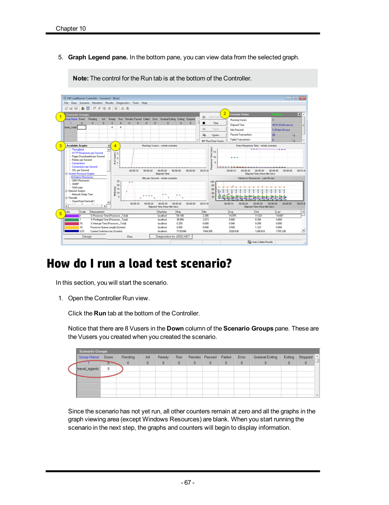
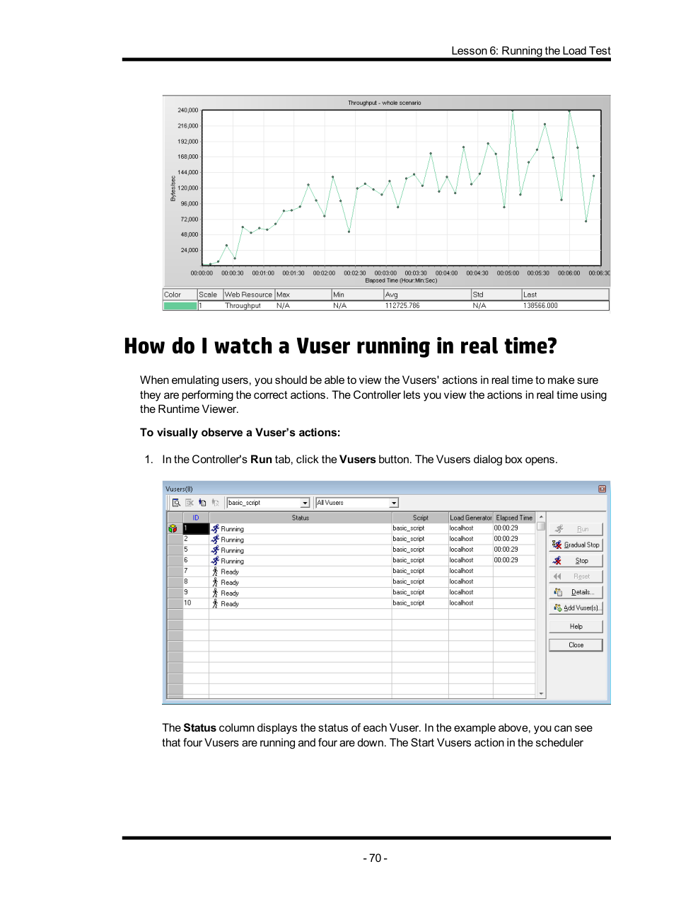
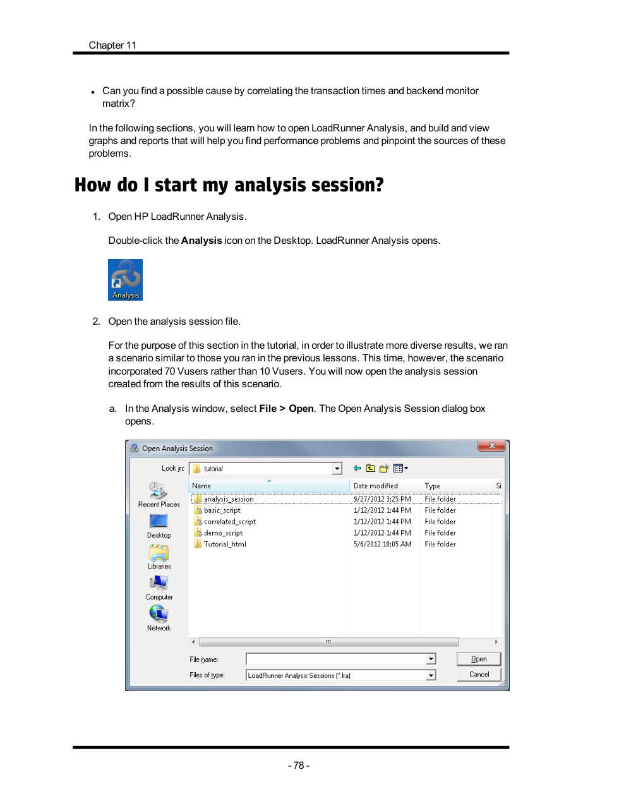

# 问题清单回答

以下回答依据仓库根目录中现有的 `Reading instructions and questions.pdf` 与 `HP_LoadRunner_12.02_Tutorial_T7177-88037.pdf` 整理如下。

## 1. What is LoadRunner used for?

LoadRunner 用于性能测试和负载测试，它可以通过模拟大量真实用户同时访问系统，观察系统在压力下的响应时间、吞吐量、资源使用情况以及是否存在性能瓶颈。

## 2. What is Vuser? What is Vuser script?

- **Vuser**（Virtual User）是虚拟用户，用来模拟真实用户在系统中的操作行为。  
- **Vuser script** 是通过录制真实业务流程生成的自动化测试脚本，它描述了用户登录、查询、提交、退出等操作步骤，后续可被重复执行并用于负载测试。

## 3. How is the test script obtained?

测试脚本通常通过 **VuGen** 获取：先创建一个空白脚本，然后录制真实用户在应用中的操作，VuGen 会把这些操作自动转换成脚本代码，最后保存为 Vuser script。

## 4. What will a test script used for?

测试脚本主要用于：

1. 回放并验证业务流程是否正确；
2. 加入事务、参数化和检查点后，模拟不同用户行为；
3. 在 Controller 中被多个 Vuser 同时执行，以产生系统负载；
4. 为性能分析提供响应时间、事务结果和日志数据。

## 5. Three screenshots during the practice and one-sentence explanation for each

下面附上三张教程练习对应的参考截图，并给出一句说明。

### Screenshot 1：Controller Run 视图

说明：该截图对应负载测试运行阶段，可以看到场景执行入口以及运行中用于观察 Vuser、事务响应时间和系统资源的图表区域。

### Screenshot 2：Vuser 实时观察

说明：该截图对应在测试运行期间查看单个 Vuser 的实时动作与状态，用于确认虚拟用户是否按预期执行脚本。

### Screenshot 3：Analysis 分析会话

说明：该截图对应 Analysis 阶段，用于打开分析会话并通过图表和报告判断是否达到性能目标以及定位瓶颈来源。
